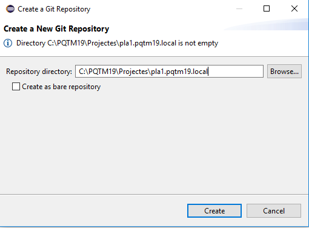
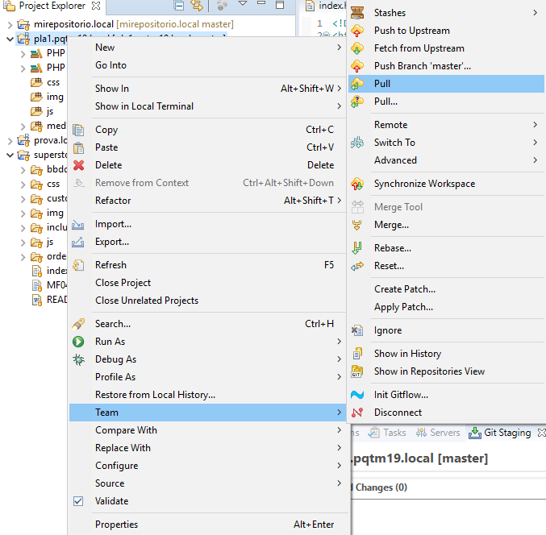

# Configuració entorn de desenvolupament web

## Introducció


## Índex
1. [Instal·lació Xampp](#1-installació-de-xampp)
2. [Configuració Virtual Host d’Apache](#2-configuració-de-virtualhost-dapache)
3. [Instal·lació de Eclipse](#3-installació-de-eclipse)
4. [Definició de WorkSpace](#4-definició-de-workspace)
5. [Definició de projecte](#5-definició-de-projecte)
6. [Definició del repositori local](#6-definició-del-repositori-local)
7. [Creació de Repositori de GitHub](#7-creació-de-repositori-de-github)
8. [Exportació de la branca “master” local sobre repositori GitHub](#8-exportació-de-la-branca-master-local-sobre-repositori-github)


## 1. Instal·lació de XAMPP

* Anem a la web [https://www.apachefriends.org](https://www.apachefriends.org) i descarreguem la versió de XAMPP que correspongui:

> 


* Descarreguem i obrim el fitxer:

> 


* Ens sortirà un avís, fem OK i s'iniciarà l'assistent d'instal·lació:

> 
> 


* Seleccionem els components que volem instal·lar:

> 


* Seleccionem el directori on volem instal·lar XAMPP i anem fent "Next" fins que finalitzi la instal·lació:

> 
> 
> 
> 
> 


* Seleccionem idioma:

> 


* Arrenquem els servidors Apache i MySQL:

> 
> 


* Si tot ha anat bé, si introduïm *localhost* al navegador hauríem de visualitzar aquesta pantalla:

> 

## 2. Configuració de VirtualHost d’Apache

* Primer de tot creem el directori del projecte:

> 


* Editem el fitxer **httpd-vhosts.conf**, que es troba a la carpeta C:\xampp\apache\conf\extra. 


* Anem sota la línia:

```
NameVirtualHost *:80
```
> El codi que hem d'introduir per crear un *VirtualHost* al directori C:/PQTM19/Projectes/pla1.pqtm19.local és:


```
<VirtualHost *:80>

	ServerAdmin webmaster@pqtm19.local
	DocumentRoot "C:/PQTM19/Projectes/pla1.pqtm19.local"
	ServerName pla1.pqtm19.local
	ErrorLog "logs/pla1.pqtm19.local-error.log"
	CustomLog "logs/pla1.pqtm19.local-access.log" common
	<Directory "C:/PQTM19/Projectes/pla1.pqtm19.local">
		DirectoryIndex index.php index.html index.html
		Options Indexes FollowSymLinks Includes ExecCGI
		AllowOverride All
		Order allow,deny
		Allow from all
		Require all granted
	</Directory>
</VirtualHost>
```
> En la següent captura ressaltem les línies de codi que fan referència al directori del projecte. Cada *VirtualHost* tindrà el seu propi bloc de codi que és idèntic tret de la referència al directori. Per tant, aquesta és l'única part del codi que haurem d'adaptar cada cop que afegim un nou *VirtualHost*.

> 

* A continuació, editem **amb permisos d'administrador** el fixer **hosts** situat a la carpeta C:\Windows\System32\drivers\etc :

> 

* Reiniciem el servidor Apache:

> 
> 

* Si introduïm al navegador el nom del *VirtualHost* que hem creat, ens hauria de sortir això:

> 

## 3. Instal·lació de Eclipse
* Cal seguir els passos que s'indiquen en les captures de pantalla (vàlid per a la versió Windows de 64 bits):

> 
> 
> 
> 
> 
> 
> 
> 
> 
> 
> 
> 
> 
> 
> 
> 
> 
> 
> 
> 

## 4. Definició de WorkSpace
* El *WorkSpace* o espai de treball és el directori arrel on es desaran els nostres projectes. Cal definir-lo quan executem Eclipse per primer cop, al final de la instal·lació:

> 

* També podem canviar-lo des de *File > Switch Workspace*:

> 

## 5. Definició de projecte
* En les captures d'exemple, exemplifiquem com crear un projecte de tipus General, que anomenarem *pla1.pqtm19.local*:

> 
> 
> 

* Veiem com apareix el projecte a l'explorador de projectes d'Eclipse:

> 

## 6. Definició del repositori local
* Ens situem a la vista Git i seleccionem la icona *"Create a new Git Repository and add it to this view"*:

> 

* Indiquem el directori on se situarà el repositori:

> 

* Un cop definit el repositori local, a mode de prova, podem fer un *Commit* dels fitxers que contingui el projecte. A la part inferior dreta de la pantalla ens apareixeran al requadre *Unstaged changes* els fitxers que continguin canvis:

> 

* Els passem al mode *staged* i pitgem la tecla *Commit*:

> 


## 7. Creació de Repositori de GitHub
Primer de tot, caldrà que ens creem un compte a Github. Un cop creat el compte els passos són els següents:

* Al damunt de la llista de repositoris de Github, seleccionem el requadre *New*:

> 

* Indiquem el nom del repositori, si és públic o privat i si volem inicialitzar el repositori amb un fitxer README.md:

> 

* Veiem que s'ha creat el repositori a Github amb el fitxer README.md:

> 

## 8. Exportació de la branca “master” local sobre repositori GitHub

Tornem a Eclipse. Abans de començar a exportar la branca "master" local al repositori Github, ens assegurarem que hem fet Commit dels fitxers tal i com hem vist a l'[apartat 6](#6-definició-del-repositori-local). A continuació indiquem els passos que cal seguir:

* Com que no tenim el fitxer README.md al repositori local, fem primer un *pull* (*menú contextual > Team > Pull*):

> 

* Ens apareixerà aquest quadre de diàleg:

> 

* Finalment, veiem com s'ha incorporat el fitxer al repositori local:

> 

* Ara, estem en condicions de fer el *push* (*menú contextual > Team > Push Branch 'master'...*):

> 

* Al quadre de diàleg seleccionem aquestes opcions:

> 

* Pitgem *Push*:

> 

* Ens apareixerà aquest quadre de diàleg:

> 

* Si anem a Github, veurem com els fitxers i els directoris d'Eclipse de la branca master que contenen fitxers s'han sincronitzat:

> 

* També podem fer el mateix des del quadre inferior dret d'Eclipse, tots els fitxers de la branca master que s'hagin actualitzat des del darrer push ens sortiran al quadre *Unstaged Changes*:

> 

* Des d'allà, si els volem pujar a Github, els passarem a *Staged Changes* i pitjarem *Commit and Push*:

> 
